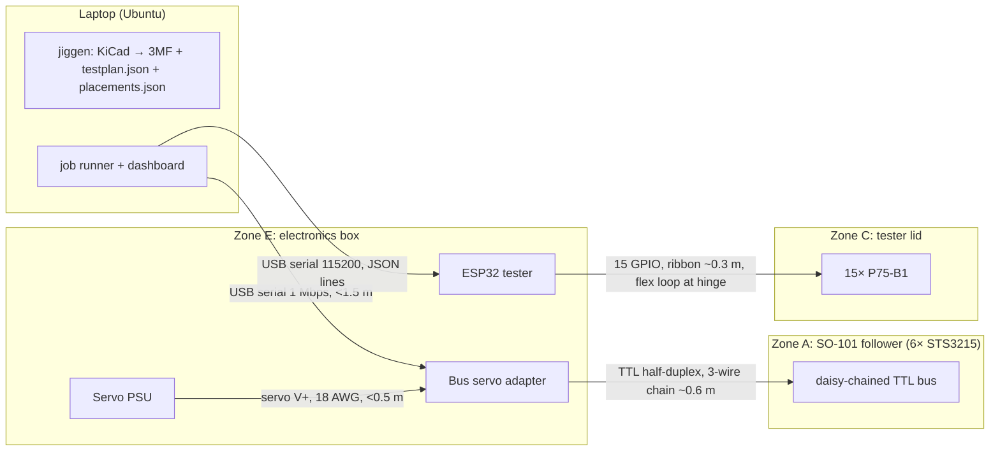

# 3DPCB — Implementation Plan (v1, 2026-09-17)

Inputs: `CONTEXT.md`, the Q&A, and the research report. Numbers marked **(verify)** are estimates to be settled by tomorrow's coupon tests, not facts.

## 0. Decisions locked in

| Topic | Decision | Why |
|---|---|---|
| Topology | Recessed: flat "floor" carries traces + leftover pour; **isolation ridges 0.2 mm tall, 0.9 mm wide** stand above it; traces ≥ 1.0 mm (1.2 preferred) | Research + strain limit of foil; 0.9 mm = two 0.45 mm lines; 0.2 mm = one layer |
| Mesh | `extrude(outline, t=1.2 mm)` + `extrude(ridges ∪ frame ∪ support ridges, 0.2 mm)` on top | Two extrusions, no booleans needed |
| Press | Soft rubber brayer (arm or hand). No per-board press die | Rigid die tears foil; removes one print per board |
| Isolation | **Wet** abrasion with a rigid, self-levelling block (400 grit), or razor scraper — chosen by coupon test | No airborne dust, no adhesive gumming |
| Joining | Sn42Bi58 paste + **iron at ~200–220 °C, ≤ 2 s per joint** (not 350 °C). No epoxy | User constraint; the Hackaday builds did solder on PLA/PETG. Gate G2 tests it |
| Robot | SO-101 **follower only**, teach-by-hand-guiding, waypoint replay. No ML, no leader | Halves cost/print time; software-friendly |
| Arm jobs | (1) roll brayer, (2) wet-abrade *if* coupon test shows ≤ ~4 N is enough, (3) push the tester-lid lever, (4) stretch: pick-and-place | Keeps every servo well under stall |
| Station | **One pocket, board never moves.** Stencil and nest drop onto corner posts; pogo pins live in a hinged lid that swings down onto the same pocket | No board transfers = no re-registration, least mechanical work |
| Test fixture | Universal: 15 pogo pins at **fixed slot positions** in the lid; KiCad template has 15 test-point footprints pre-placed at those slots (two columns along the long edges) | Zero per-board fixture work; 15 points fit on ESP32 GPIO directly, no mux |
| Test timing | Bare board after isolation (continuity/shorts vs netlist), then functional power-up after assembly | Parts create false "shorts" |
| Per-board prints | Board + nest plate + 0.2 mm stencil on one plate. Stencil fallback: hand syringe dots | Print time is the bottleneck |
| Board rules (DFM) | Single-sided, SMD only, no vias, ≤ 45 × 70 mm, 1206 passives, ICs at 2.54 mm pitch (DIP-8 with legs splayed flat), trace ≥ 1.0, gap = 0.9, test points on template slots | Tape width 50.8 mm; 0.4 mm nozzle |
| Gantry | Dropped. Only revisit if venue explicitly OKs a clip-on tool on an A1 | No Ender 3; A1 permission unlikely |

### Where I disagree with the research report
- *"Discard soldering."* It assumed a 350 °C iron and whole-board reflow. With 138 °C alloy, a 200–220 °C tip and short dwell this is the same thing the three Hackaday builds did. Test G2 decides; don't buy $100 epoxy on speculation.
- *"Sanding needs 30 N; arm can't."* Unsourced, and it describes full-surface dry hand sanding. We only cut 35 µm foil on narrow ridge tops, wet. Measure tomorrow on a kitchen scale. If it needs > ~4 N, a human does this step (20–40 s) and the arm keeps its other jobs.
- *"Arm can exert 20 N."* Ignores the arm's own weight and real reach (~25–30 cm). Plan on **≤ 3–4 N continuous**, and get force from springs/levers, not servo torque.
- *"Arm can't press the pogo bed."* True for direct pressing; solved with a **lever lid** (≥ 4:1) and only 15 pins at partial stroke (~15 × 50 g ≈ 0.75 kg → < 2 N at the lever end) **(verify)**.
- PCB Forge min feature "2.5 mm" applies to pads/holes, not traces. Our DOE settles our own limits.

## 1. System layout (one 400 × 300 mm plywood/MDF base)

```
LOCATION MAP
Zone A  Arm base          SO-101 follower screwed/clamped to the board, back-left corner
Zone B  Board pocket      ~200 mm in front of the shoulder axis; pocket + 4 corner posts; board top sits 0.5 mm proud
Zone C  Hinged tester lid hinge behind pocket; carries 15 pogo pins; lever arm sticks out toward the arm; ribbon to Zone E
Zone D  Tool rack         right of pocket, within 250 mm reach: brayer, abrasion block, (vacuum nozzle)
Zone E  Electronics box   ESP32 (tester) + servo adapter + PSU, back-right; USB to laptop
Zone F  Part tray         stretch only; left of pocket
```



Constraint flags
- ⚠ Servo supply must match the servo version (12 V vs 5–7.4 V). Wrong supply kills servos. Label the PSU.
- ⚠ Never power servos from the laptop USB; the adapter has a separate barrel/screw input. Common ground is via the adapter.
- ⚠ Ribbon at the lid hinge flexes every cycle: leave a 40 mm service loop, strain-relieve both ends with a zip tie.
- ⚠ Wet abrasion next to electronics: Zone E sits behind a 20 mm printed lip/raised on standoffs; abrade with a damp (not dripping) block; wipe with a paper towel before the lid closes.
- ℹ Copper tape seams: none — one 50.8 mm sheet per board, so adhesive conductivity is irrelevant except as a bonus.

Tester pin map (ESP32 DevKit, all have internal pull-ups, none are strapping pins):

| Slot | GPIO | Slot | GPIO | Slot | GPIO |
|---|---|---|---|---|---|
| TP1 | 4 | TP6 | 18 | TP11 | 25 |
| TP2 | 13 | TP7 | 19 | TP12 | 26 |
| TP3 | 14 | TP8 | 21 | TP13 | 27 |
| TP4 | 16 | TP9 | 22 | TP14 | 32 |
| TP5 | 17 | TP10 | 23 | TP15 | 33 |

Scan: for each i → pin i `OUTPUT LOW`, all others `INPUT_PULLUP`, read all; row i of the connectivity matrix. 15 passes, < 50 ms. Only one output is ever driven, so series resistors are optional. Functional test: after assembly, firmware drives the two slots tagged `VCC`/`GND` in `testplan.json` (3.3 V from a GPIO is enough for an LED demo at a few mA; otherwise wire the 3V3 pin through a jumper).

## 2. Materials

**In hand:** QILIMA 2" conductive-adhesive copper tape · 100× P75-B1 pogo pins · 120 W adjustable iron · PETG, PLA · P1S (0.4 mm) · dual-boot Ubuntu laptop. **Ordered:** 2× ESP32, multimeter.

**Order today (must arrive before you leave for Waterloo; else ship to a Waterloo address/locker):**
1. 6× STS3215 / Waveshare ST3215, all one voltage, or a one-box SO-ARM101 servo kit
2. Bus servo adapter (Waveshare (A) or FE-URT-1) + USB cable — skip if the servo bundle includes one
3. Matching PSU (12 V ≥ 5 A, or 5–7.4 V ≥ 5 A) 
4. Sn42Bi58 paste syringe + no-clean flux pen
5. 1206 LED + resistor assortment; 555 (DIP-8) ×10 and/or ATtiny85 ×3; CR2032 + SMD/any holder or 2-pin header
6. Stretch only, if cheap: 12 V micro vacuum pump, 3-way 12 V solenoid valve, logic-level MOSFET module, silicone tubing 3/5 mm, blunt luer needles assortment

**Pick up locally today/tomorrow morning:** soft rubber brayer ~4" (Michaels/DeSerres) · wet/dry paper 240 + 400 + 600 · single-edge razor blades · ink eraser / abrasive rubber block · 400 × 300 mm plywood or melamine board · 2 C-clamps · wood screws, M3 × 10/16 screws + nuts · 2–3 small compression springs (pen springs work) · ribbon/hookup wire + Dupont jumpers · double-sided foam tape · isopropyl wipes, paper towels · zip ties · kitchen scale (if you don't own one) · silicone/self-fusing tape or wide rubber bands for gripper pads (no TPU available) · spare PETG spool · SD card for the A1s · tweezers.

## 3. Prep day (2026-09-18) — 18 h of P1S

| Clock | Print | Meanwhile |
|---|---|---|
| 0:00–0:40 | **Coupon plate** (below) | Buy local items |
| 0:40–~9:30 | **SO-101 follower** (official repo Bambu plate, their settings) **(verify time)** — only if a servo order is confirmed to arrive before hackathon start; otherwise skip and give these hours to kits + spare station parts | Run tests T1–T4; pick parameters; send them to SW1 |
| ~9:30–13:30 | Station: pocket + corner posts, hinge lid with pogo slot holes + lever, tool rack, brayer adapter, abrasion block (pivot + spring), electronics tray, lip | Servo bring-up if arrived (T5); wire pogo lid |
| ~13:30–16:30 | Demo kits ×4 with chosen params (board + nest + stencil); if no demo design yet, print the **template test board** (15 TPs + a few traces + 1206/DIP-8 lands) ×6 | Assemble station on the plywood |
| 16:30–18:00 | Buffer / reprints | Pack |

Coupon plate (each 25 × 40 mm, PETG, 0.2 mm layers, Arachne on, **ironing off**, relief face up):
- C1–C4: ridge width {0.45, 0.9} × ridge height {0.2, 0.4}; each coupon carries trace widths 0.8 / 1.0 / 1.2 / 1.5 / 2.0, a 1206 land pair, and a 2.54 mm-pitch 8-pad land; ridge walls chamfered where height is 0.4.
- C5: knife-edge ridges (single 0.45 line, 0.4 tall) to see if pressing alone shears the foil.
- C6 (PLA copy of the best guess, C2) for the iron test.
- H1: pogo hole gauge 1.00 / 1.05 / 1.10 / 1.15 / 1.20 mm, 6 mm deep.
I can generate these STLs for you tonight (parametric script) — say the word.

Tests and gates
- **T1 press:** tape → brayer by hand. Look for tears in channels, wrinkles. Compare against pressing with an ink eraser/soft pad.
- **T2 isolate:** on a kitchen scale, wet 400-grit rigid block; note force and strokes to break through all ridges. Repeat with razor scraper and with abrasive rubber. Record mess level.
- **G1 (pass criteria):** adjacent traces > 1 MΩ, each trace end-to-end < 1 Ω, no lifted foil. Choose smallest passing geometry + the method that works at the lowest force. If ≤ ~400 g works → arm abrades; else human abrades.
- **T3 / G2 joining:** paste on 1206 lands (PETG and PLA coupons), iron 200 → 220 → 250 °C, ≤ 2 s. Pass = part holds a fingernail shove, ridge not collapsed, < 1 Ω pad-to-terminal. If PETG fails but it works with a Kapton-free quick touch on wider lands, enlarge lands in DFM rules. If everything fails: fallback is a printed PETG clamp cover with cantilever fingers (solderless) — decide at the venue, not tomorrow.
- **T4 pogo fit:** choose hole size giving a firm press fit; check a 15-pin lid closes with light lever force.
- **T5 servos (Ubuntu):** `lerobot-find-port` → `lerobot-setup-motors` (IDs 1–6) → read positions. If servos arrive late this moves to hackathon hour 0.

## 4. Software modules (interfaces first, so three people can work in parallel)

```
jiggen/     SW1   in: board.kicad_pcb  → out/: board.3mf, nest.3mf, stencil.3mf, plate.3mf,
                  testplan.json {slots:[{tp:"TP3", net:"OUT", gpio:14}], expect:[[...]] , vcc:"TP1", gnd:"TP2"},
                  placements.json [{ref,value,package,x,y,rot}], dfm_report.json, cost_time.json
tester/     SW3   ESP32 firmware: serial JSON lines  {"cmd":"scan"} → {"matrix":[[0/1...]]} ; {"cmd":"power","on":true}
                  host: compare(matrix, testplan) → per-net pass/open/short
armctl/     SW2   teach.py (torque off → record named waypoints → poses.json), play.py (interpolated sync_write @50 Hz,
                  torque-limit set low), skills: roll(), abrade(n_strokes), close_lid(), open_lid(), [pnp(placements)]
runner/     SW3   state machine: GENERATE → PRINT(wait/confirm) → TAPE(human confirm) → ROLL → ABRADE → WIPE(human) →
                  TEST_BARE → PASTE → PLACE → SOLDER(human) → TEST_FUNC ; every step has mode = arm | human
dashboard/  SW3   step status, live timer, pass/fail net map drawn from the board outline, cost breakdown
```

jiggen recipe (SW1): `kiutils` parse → shapely: tracks (buffered segments/arcs), pads (rect/roundrect/circle/oval only — reject others in DFM), F.Cu only → `copper` → `ridges = buffer(copper, 0.9) − copper` → add outer frame + support ridges (hatch every ~8 mm in empty areas, clipped ≥ 0.9 mm away from copper... they merge into the pour, which is fine) → drop ridge slivers < 0.8 mm (`buffer(-0.4).buffer(+0.4)`) → mirror Y → `trimesh.creation.extrude_polygon` ×2 → 3MF. Nest: plate with pockets = part body + 0.3 mm clearance, 60° funnel, located on corner posts. Stencil: 0.2 mm sheet, apertures = pad shrunk 0.1 mm, min aperture 1.0 mm. Nets/test points from the same kiutils parse (footprints with ref `TP*` → slot by position). **Timebox:** if pad geometry isn't right by hour 6, switch geometry source to `kicad-cli pcb export gerbers` + a Gerber→shapely parser and keep kiutils only for nets/placements. Slicing: try Bambu Studio/OrcaSlicer CLI for 1 hour; otherwise slice by hand in the GUI (30 s) and read the time estimate from the 3MF — not worth more time. Printing on venue A1s is by whatever route the venue offers (likely SD card / their laptop).

armctl notes (SW2): everything is taught poses relative to the fixed station — no IK for the core jobs. Set each servo's torque limit low for contact moves; contact force comes from the tool spring (command ~5 mm "into" the surface). Wrap every motion in a fault check (read status/load; on overload → stop, relax, tell runner to fall back to human). PnP stretch: teach 4 corner poses + centre over the nest with a pin-in-hole touch-off, bilinear-interpolate joint angles; part stays on the nozzle until it bottoms out in the funnel.

## 5. The 48 hours

| Hours | You (mechatronics) | SW1 | SW2 | SW3 |
|---|---|---|---|---|
| 0–4 | Station on table, process by hand on a pre-printed kit, pogo lid wired | kiutils → shapely → first board mesh of the template board | Arm assembly from the official guide (with one helper), motor IDs, calibrate | Firmware scan + host compare against a hand-written testplan |
| 4–12 | First venue print of a generated board; tune DFM numbers; tools fitted to gripper | nest + stencil + testplan/placements export; DFM report | teach/play; `roll()` and `close_lid()` working | runner skeleton + dashboard; live timer |
| **12 — G3** | **Manual-mode end-to-end: KiCad → board lights up, timed.** This alone is a complete demo. | | | |
| 12–20 | Demo circuit (the funny one) designed in KiCad on the template; abrasion tool tuning | polish, cost/time json, second design | `abrade()`; fault handling; full arm sequence | pass/fail map UI; functional test |
| **20 — G4** | **Arm does roll → abrade → lid/test on a real board.** | | | |
| 20–32 | Vacuum nozzle + tray **only if G4 passed**; else reliability runs | headless slice (timeboxed), printability warnings in UI | PnP stretch or reliability | timed full runs, record timelapse |
| 32–40 | Stretch: tape-laying aid, more designs | | | pitch deck, comparison table |
| 40–48 | **Feature freeze.** Spares printed, backup video, rehearsals, sleep | | | |

Demo (works for table or stage judging): drop KiCad file → DFM + models appear → print starts live on an A1 (or "here's one from 15 min ago") → human lays tape → arm rolls, abrades, closes lid → net map goes green → paste, place through nest, solder ~10 joints → lid closes, LED joke lights up → timer stops. Uncut timelapse of a full run plays alongside.

## 5b. Design-review fixes (v1.1) — leaks found when walking the line end to end

1. **Locating posts vs. brayer/abrasion block.** Nothing may stand higher than the ridge tops inside the tool stroke. Posts go on the two *short* sides only, outside the stroke (tools travel along the long axis, block narrower than the post spacing). Stencil/nest plates are longer than the board and hook onto those posts.
2. **Tape overhang.** Board is 52 mm wide with a ≥ 2 mm frame ridge; the 50.8 mm tape lands *on* the frame, never over the edge. Copper area ≤ 46 mm wide. A printed cutting guide gives the sheet length (board length − 4 mm).
3. **Board lift-out during wet abrasion.** Pocket gets an undercut lip on one long edge + a thumb-latch on the other (or double-sided tape as the quick fix).
4. **Parts sit on a ridge.** Every 2-terminal part straddles a 0.2 mm ridge, so its terminals hover ~0.2 mm above the pads. Joint must bridge that gap → generous paste, iron touches pad + terminal end. **Add to T3: solder a 1206 across a ridge, not just onto a flat land.** DIP-8 legs get bent down 0.2 mm.
5. **Stencil stands 0.2 mm off the pads** (it rests on ridge tops) → paste bleeds under it. Ridges act as dams and bare-plastic ridge tops act as solder mask, so it may be tolerable, but **default paste method = hand syringe dots**; printed stencil is an experiment, not on the critical path.
6. **Nest blocks the iron.** Nest is lifted straight up before soldering (drafted pockets, two finger tabs); paste tack holds the parts. Check in T3 that lifting doesn't drag parts.
7. **Lid hides the board in the functional test.** Lid is an open frame: pogo slots only along the two long edges, centre cut out so LEDs are visible (and a webcam can see them).
8. **Lid alignment.** Hinge pin = M3 bolt; final XY location comes from the lid seating on the pocket posts, not from the hinge. Test-point lands ≥ 2.5 mm Ø.
9. **Opens beyond a test point are invisible to the bare test.** Rule: any net longer than ~30 mm or with a branch gets two test points (15 slots, ~8 nets → there's room). The functional test catches the rest.
10. **Arm paths.** Rolling/abrading need straight strokes; joint-interpolated waypoints curve. Record the **whole hand-guided trajectory at 50 Hz** and replay it, instead of sparse waypoints.
11. **Honest automation level.** Humans still do: lay tape, wipe slurry, paste, (place), solder. Pitch it as *robot-assisted*, with the arm owning roll → isolate → test, and PnP as the stretch.

Time budget per board **(verify)**: print 15 · tape 1 · roll 0.5 · abrade 1 · wipe + bare test 1 · paste 2 · place 3 · solder 4 · functional test 0.5 ≈ **28 min**.

## 6. Contingencies

| Risk | Trigger | Fallback |
|---|---|---|
| Servos don't arrive | No delivery before hour 0 | Manual mode is the product; runner has `human` mode for every step; ask venue/other teams for an SO-100/101 |
| Venue A1s unavailable / no own filament | Queue > 1 h or refused | 4–6 pre-printed kits of the final design; show generation + slicing live, print is "cooking-show" swapped |
| Foil tears / won't isolate | G1 fails on all coupons | Wider traces (2 mm), 0.2 mm ridges only, scraper; last resort raised-trace + scalpel for the demo board |
| Iron melts PETG | G2 fails | Bigger lands + pre-tin + 200 °C; PLA vs PETG whichever survived; clamp-cover solderless |
| Arm overloads on abrasion | Faults or > 4 N needed | Human abrades; arm keeps roll + lid |
| Pogo lid force too high | Lever needs > 3 N | Fewer pins populated (only slots in use), longer lever, or human closes lid |
| SW1 geometry stuck | Hour 6 | Gerber route; or hand-made SVG → extrude for the demo board only |
