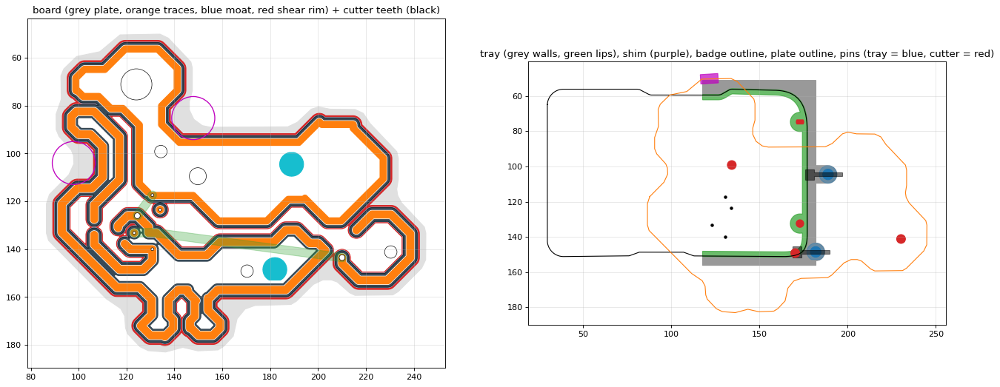

# 3DPCB

3D-printed, copper-tape circuit boards: a middle ground between perfboard and a fabbed PCB.

**KiCad file → 3D-printable board + cutter → copper tape pressed and sheared → parts soldered.**

Built at Hack the North 2026 (36 h). The demo is a goose-shaped "Operation" game that docks onto the event's hacker badge: the copper traces are the maze walls, the tweezers are tied to badge GND, and touching a wall pulls a badge button line low. No components on the board at all.



## How the fabrication works

A printed board alone is not enough: the hard part is trimming the tape to the traces. We print two plates.

```
            cutter plate (pressed down once, then pried off)
   ─────────┐  groove  ┌─────────────
            │          │ tooth
            │ ┌──────┐ │ ▼
 rim ▄      │ │trace │ │      ▄ rim      <- tape is sheared between tooth and rim
 ────┘└─────┘ └──────┘ └─────┘└──────    <- board plate; the dips are the "moat"
```

- Every trace is a **raised land** (3 mm wide, 1 mm tall) surrounded by a **moat** and a low **shear rim**.
- Lay copper tape over the whole board, press the **cutter** on (alignment pins locate it). Its teeth drop into the moats, wipe the tape down the trace sidewalls and shear it against the rim. Peel away the waste.
- Holes are sized for P75 pogo pins (press fit) and M2 screws / wire vias. Back copper sits in shallow recesses.

All the numbers (moat width, shear gap, hole sizes, ...) are named parameters at the top of [tools/kicad2fab.py](tools/kicad2fab.py). The shear gap is **the** value to tune on a test coupon; none of the fits have been measured on a real print yet.

## Quick start

```bash
pip install shapely matplotlib
```

```bash
python tools/kicad2fab.py goose/goose_landscape_v3.kicad_pcb --badge "Archive 2/badge.kicad_pcb" --turns 1 --open SW6 SW7 --preview preview.png
```

This writes `goose/goose_landscape_v3_fab_clamshell.fs` and prints a report (Z levels, hole counts, where two nets share a moat and need a knife score). To get printable bodies:

1. In Onshape, create a **Feature Studio** tab and paste the `.fs` file in. If it complains about the version, keep the first two lines Onshape generated.
2. In a Part Studio, add the custom feature ("3DPCB clamshell set - ..."). Tick the bodies you want; "Exploded view gap" separates them.
3. Export each body as STL/3MF. Print settings are in [CLAUDE.md](CLAUDE.md) ("Printer tolerances").

> `kicad2fab.py` has no direct STL output. The general **KiCad → STL/3MF** converter is `tools/kicad2cad` on branch `feat/kicad2cad` (plain raised-copper board today). The plan is to port the moat / rim / cutter geometry from `kicad2fab.py` onto it — see [docs/PIPELINE.md](docs/PIPELINE.md#4-roadmap-generalising-the-pipeline).

## Convert a board in the browser

`web/` is a small web app around `tools/kicad2cad`: pick a sample board or drop in your own `.kicad_pcb`, watch the five conversion steps stream past, spin the result in 3D, change any setting and see it rebuild, then download the STL/3MF.

```bash
./web/dev.sh        # API on :8765, UI on :5173
```

Deployment (Render + Vercel) and the API reference: [web/README.md](web/README.md). Working on the UI: [web/app/README.md](web/app/README.md).

## Drawing a board in KiCad

| Layer | Becomes |
|---|---|
| `Edge.Cuts` | Plate outline (largest closed shape) and through cut-outs |
| `F.Cu` tracks + vias | Raised traces, grouped by net |
| `B.Cu` tracks | Recesses in the back for tape |
| vias | Through holes (pogo-pin size at the known pogo positions, otherwise via size) |
| `User.1` | Pockets in the top face (`kicad2fs.py` only) |
| `Dwgs.User` | Ignored — the badge tracing guide lives here |

Targets for the current process: 3 mm tracks, ≥ 3 mm between different nets (≥ 5 mm if you want every trace sheared automatically), 45° corners, outline ≥ 4 mm outside the copper.

`kicad2fab.py` currently reads **tracks (`segment`) and vias only** on copper layers. Zones, arcs and footprint pads are understood by `kicad2fs.py` but not yet by the fab generator.

## Tools

| Script | What it does |
|---|---|
| [tools/kicad2fab.py](tools/kicad2fab.py) | **Main generator.** Board + cutter + badge tray + keys + clip + plungers + pin gauge, as one FeatureScript. `--style clamshell\|slide`, `--open SWn` for buttons that must stay pressable, `--preview x.png`. |
| [tools/kicad2fs.py](tools/kicad2fs.py) | Plain board only (plate, raised copper, pockets, holes). Also the shared library: S-expression parser, KiCad geometry, badge reference. |
| [tools/make_goose_template.py](tools/make_goose_template.py) | Blank KiCad board with the badge traced on `Dwgs.User` and the four pogo vias placed. Start new badge add-ons from this. |
| [tools/scale_tracks.py](tools/scale_tracks.py) | Scale all tracks about a point and set their width (KiCad has no scale tool). |

## Repository layout

```
tools/      generators (Python, needs shapely)
goose/      the demo board: KiCad source, generated .fs, previews; history/ = older drawings
Archive 2/  the organisers' badge KiCad project (read-only reference, not ours; tests depend on this path)
docs/       PIPELINE.md = how kicad2fab works + roadmap; kicad2cad-plan.md = the general converter's plan
app/        badge app (branch feat/badge-app)
web/        browser UI for the converter: web/api (FastAPI) + web/app (React + three.js)
PLAN.md, RESEARCH_PROMPTS.md   the parked robot-assembly plan
CONTEXT.md  badge pin map, pad coordinates, interface options, earlier ideas
CLAUDE.md   project brief, decisions, constraints, tolerances (also the instructions for Claude Code)
```

## Status

- Generator output is reproducible and self-checked in 2D (no touching regions, no invalid polygons), but the FeatureScript has **not yet been verified inside Onshape** and nothing has been printed from it.
- Button-pad sensing is verified on a real badge (jumper from the pad to GND registers as a press).
- Fit values come from a researched tolerance guide, not measurements. Print a coupon first.

`Archive 2/` contains the Hack the North badge hardware files, © their authors; they are included only as a dimensional reference.
